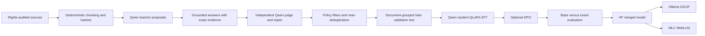

# Architecture

The project uses response distillation because a local Ollama model exposes
generated responses but not its internal token distributions. The teacher is
therefore treated as a fallible synthetic-data author, never as ground truth.

## Trust boundaries

1. **Sources:** a manifest records licence, rights basis and redistribution
   status before text is read.
2. **Generation:** teacher output is constrained by a JSON schema, but it is
   untrusted until locally validated and adjudicated.
3. **Dataset:** exact evidence, content policy and de-duplication are enforced
   independently of the LLM.
4. **Training:** only accepted examples enter SFT. Optional preference pairs are
   generated only after an answer is accepted.
5. **Release:** a model is an artefact with its own manifest and evaluation
   record. It is not automatically copied into LibeRation.

## Reproducibility

All file and text identities use SHA-256. Generation records contain teacher
name, options, seeds and timestamps. JSONL is append-only during long-running
LLM work; completed chunk IDs make interrupted jobs resumable. Final datasets
are atomically rewritten in deterministic order.

This does not make sampling perfectly bit-reproducible across Ollama versions or
GPU kernels. The manifests make those differences observable.
