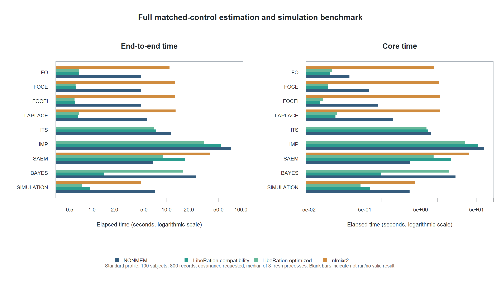

# Final matched-control benchmark: 11 August 2026

This release-candidate benchmark used the standard ADVAN1/TRANS2 IV-bolus
fixture with 100 subjects and 800 records. Every reported value is the median
of three fresh-process measurements after one unmeasured warm-up. Covariance
was requested where applicable, NONMEM FO included `POSTHOC`, and all engines
were restricted to one core.

Core time is fitting plus requested covariance. LibeRation context and tape
initialization is included in end-to-end time but excluded from core time.
NONMEM uses its reported estimation and covariance timers when available;
nlmixr2 core time is its complete estimator call because stable phase-specific
timers are not exposed.

| Method | NONMEM E2E | NONMEM core | LibeR compatibility E2E | LibeR compatibility core | LibeR optimized E2E | LibeR optimized core | nlmixr2 E2E | nlmixr2 core |
| --- | ---: | ---: | ---: | ---: | ---: | ---: | ---: | ---: |
| FO | 4.540 | 0.266 | 0.670 | 0.120 | 0.670 | 0.130 | 10.940 | 8.770 |
| FOCE | 4.500 | 0.594 | 0.610 | 0.110 | 0.600 | 0.110 | 12.980 | 10.680 |
| FOCEI | 4.510 | 0.875 | 0.590 | 0.080 | 0.580 | 0.090 | 13.170 | 10.950 |
| LAPLACE | 5.530 | 1.625 | 0.650 | 0.150 | 0.660 | 0.160 | 13.220 | 11.050 |
| ITS | 11.590 | 7.641 | 7.250 | 6.780 | 6.830 | 6.350 | not run | not run |
| IMP | 73.250 | 69.125 | 54.430 | 53.950 | 31.930 | 31.450 | not run | not run |
| SAEM | 6.570 | 3.219 | 17.880 | 17.400 | 9.030 | 8.560 | 38.690 | 36.410 |
| BAYES | 24.810 | 21.109 | 1.440 | 0.970 | 16.450 | 15.990 | not run | not run |
| SIMULATION | 6.940 | 3.172 | 0.930 | 0.620 | 0.730 | 0.420 | 4.600 | 3.940 |

## Interpretation

- LibeRation was faster than NONMEM end to end for every workload except SAEM.
- The optimized IMP path reduced median core time from 53.95 to 31.45 seconds.
- Optimized SAEM reduced the compatibility path from 17.40 to 8.56 seconds,
  but remained slower than NONMEM's 3.219 seconds. LibeRation's complete SAEM
  timing includes the post-fit 200-sample marginal-likelihood score introduced
  to give the reported objective explicit likelihood-comparable semantics.
- Compatibility BAYES uses the deliberately simple matched sampler and is not
  an efficiency comparison against the richer adaptive optimized sampler.
- nlmixr2 has no exact ITS or BAYES mapping in this harness. Its IMP warm-up was
  stopped after exceeding five minutes without a result and reproducing the
  previously observed singular-repair/non-completion behaviour.

These measurements compare workflows and controls, not mathematical identity.
Deterministic parameter estimates agreed closely with NONMEM; stochastic
methods retain engine-specific random-number streams and proposal details.

The tracked directory contains only derived timing tables and plots. Raw
NONMEM working directories, control outputs, and listing files remain ignored
and are not published.
